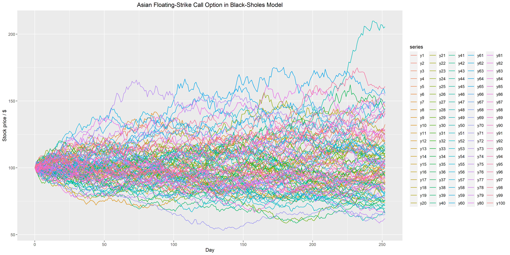

# Financial Markets
1. European and American Plain-Vanilla Call and Put Option Pricing in the Binomial Model (Discrete Time)
2. Asian Floating-Strike Call Option Pricing in the Black-Scholes Model (Euler-Maruyama and Milner Methods)

3. Down-And-Out Barrier Call Option Pricing in the Heston Model (Continuous time)
